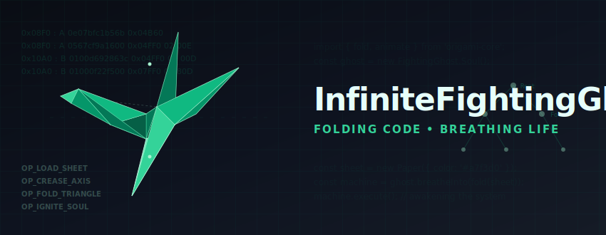
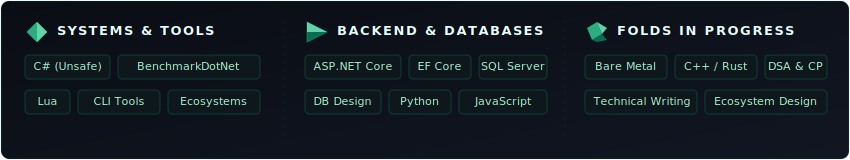
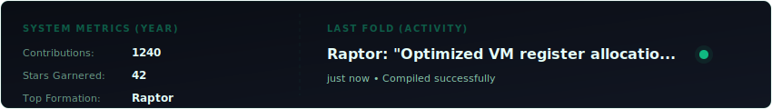

  

  
  
  

---

> **Origami** is the art of folding paper to create form from emptiness. 
> **Coding** is the art of structuring instructions to breathe life into silence. 
> Both begin with a blank sheet, and both end with a creation that is greater than the sum of its parts.

---

### 🪶 The Philosophy of Folding

I am a software engineer specializing in **systems, tools, and backend development**. Working daily in C# (including low-level unsafe memory manipulation), I fold logic with mathematical precision. My background is rooted in constructing resilient database architectures, designing robust APIs, and tuning performance using BenchmarkDotNet. 

I view code not just as instructions, but as a structure to be folded and creased until a static program awakens into a living, high-performance system.

---

### 📐 The Crease Pattern (Technical Toolbelt)

Below is the layout of the languages, frameworks, and active learning paths I fold into my daily engineering:

  

---

### 📡 System Metrics & Live Status

This dynamic status panel updates automatically every hour to show my active coding metrics and what I'm listening to on Spotify:

  

---

### 📂 Featured Formations (Projects)

Here are some of the systems I have folded and brought to life:

*   **[Raptor](file:///home/andy/Projects/GHProfileReadme/InfiniteFightingGhost/Gemini_Generated_Image_53cfg53cfg53cfg5.png)**: A lightweight, zero-overhead C# Virtual Machine and scripting engine. Built for sandboxed script execution, featuring a custom register-based bytecode interpreter and deterministic garbage collection.
*   **[crease-db](https://github.com/InfiniteFightingGhost/crease-db)**: A high-performance database schema and storage backend built using EF Core and SQL Server, optimized for zero-allocation critical query paths.
*   **[benchmark-folds](https://github.com/InfiniteFightingGhost/benchmark-folds)**: A technical framework of micro-benchmarks analyzing memory layouts and JIT compilation optimization behaviors in unsafe C# loops.

---

### ⚡ The Folding Process

My approach to building software mimics the stages of physical creation:

1.  **The Crease Pattern (Design)**: System architecture is planned with mathematical rigor. I trace data flow, design relational tables, and map tool constraints before writing code.
2.  **The Fold (Implementation)**: Translating blueprints into robust, deterministic implementations. I prioritize zero-allocation paths, clean API boundaries, and low-level memory layout control.
3.  **The Breath (Awakening)**: Optimization and execution. Profiling routines with BenchmarkDotNet, examining compiled IL instructions, and tuning memory allocations until the machine runs flawlessly.

---

  <i>"Bringing life to paper. Bringing life to machines."</i>

